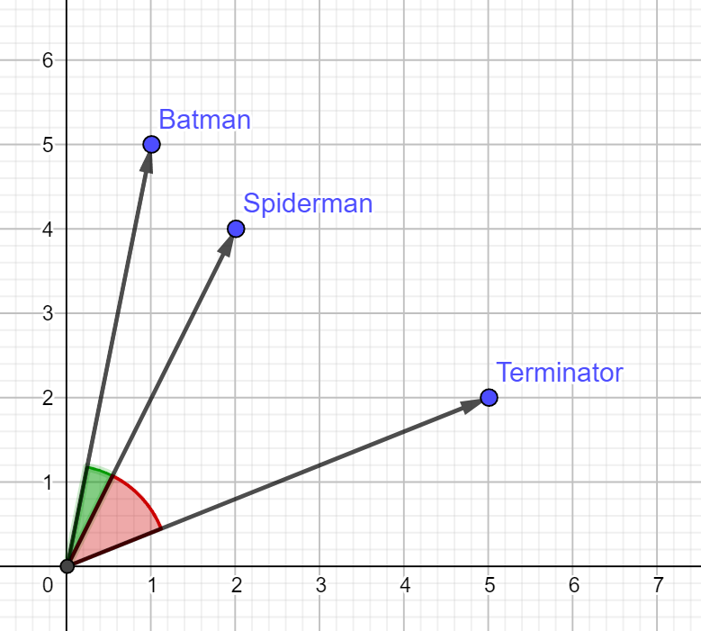

# Movie Recommendation System

### Using Machine Learning to Predict Similar Movies based on User Ratings

By: [Andreas Svensson](https://github.com/Andreas-Svensson)  
Code-along credit: [Wennovation](https://www.youtube.com/watch?v=4Ws0oPH350U&ab_channel=WennovationAcademy)  
Data used: [Movielens Dataset](https://grouplens.org/datasets/movielens/)  
Model used: KNN  

---

## Technical Description  

### The recommender system works as follows:  

#### Set up data

- Load in dataset
- Create a sparse matrix from movieId and userId, using rating values  
    The sparse matrix only stores non-zero values, thus takes up less space  

#### Sparse matrix structure

The matrix is made up of movieId as rows and userId as columns, as a dense matrix this would be largely represented by zeroes, but the sparse matrix format only stores indices with non-zero values in this format:

| movieId, userId | rating |
| --- | --- |
| (0, 0) | 4.0 |
| (0, 4) | 4.0 |
| (0, 6) | 4.5 |
| (0, 14) | 2.5 |  

For example, we see that userId 6 has given movieId 0 a rating of 4.5 stars.  

Since all unique movieId's have been added to the matrix to avoid index mismatches, the movies without a rating are represented by an empty index. For example, using the small dataset and looking at index 816 which is a movie with no ratings, it will only print and empty string instead of giving an error.  

#### Model:
- A KNN model with the following parameters is created and fitted to the matrix:
    ```py
    metric = "cosine", algorithm = "brute"
    ``` 
    Parameter explanation:
    - Brute - the model looks at every movie vector and compare them with the input movie vector.  
    - Cosine - the comparison is based on cosine simularity, which means the vector with the smallest angle to the input movie vector will be deemed most similar and thus recommended.  

#### Visual explanation of movie vectors

Below is a simplified representation of the dataset which only has two users and 3 movies. The users, User1 and User2, are represented as the x- and y-axis. The movies are the vectors, which are made up of the two users' ratings. For example, the movie "Terminator" has been rated 5 stars by User1, and 2 stars by User2.

If a new user types in the title "Spiderman" the model will look at the spiderman vector (2, 4), and calculate the angle to the other 2 movies; Batman (1, 5) and Terminator (5, 2). Since the angle between Spiderman and Batman (green) is smaller than the angle between Spiderman and Terminator (red), the system will recommend Batman first.  



In the actual model there are thousands of users and movies, with millions of ratings. As such the cosine simularity is calculated between as many vectors as there are movies, in as many dimensions as there are users. The 10 most similar movies based on the smallest angles to the input movie vector are then recommended to the user.  

#### Step-by-step of the recommender function:
- Function recommender takes a movie title string  
- Closest match in df_movies is selected using fuzzywuzzy  
- Index of matched title in df_movies is stored as idx  
- Same index of sparse matrix is sent to the model to calculate cosine simularity on (this returns most to least similar vectors based on rating)  
- Iterate over returned indices, and print out the title of the indices from df_movies

---

## Other Recommendation Systems

### Some information about how other recommendation systems work

There are several different types of recommendation systems: [^1]


- Content-based systems that analyze the features of items to recommend other items with similar attributes  


- Collaborative filtering systems that rely on user behavior data to identify patterns and recommend items that similar users have enjoyed  


- Hybrid systems that combine these approaches to provide more accurate and diverse recommendations

- Context filtering takes into consideration things such as user's country, date, time and so on to predict their behaviour.

Some examples of recommendation systems in radio: [^2]
- Las<span>t.</span>fm has an individual "station" based on the listener's history compared to that of other users. Similar to this laboration, this is an example of collaborative filtering.  
- Pandora instead uses the properties of a song to find other songs with similar properties. Based on user ratings, different properties will be weighted differently. This is an example of a content-based system.


Recommendation systems are widely used in e-commerce, social media, and content platforms to improve user engagement, increase customer satisfaction, and drive revenue. They can also be used in other domains to provide personalized recommendations and improve outcomes.

To build a recommendation system, machine learning engineers typically start by collecting and preprocessing data from multiple sources, such as user behavior logs, item descriptions, and user profiles. They then use statistical models and algorithms to analyze this data and generate recommendations for each user.

They also present several technical challenges, such as data sparsity, scalability, and cold-start problems, which require careful consideration and specialized techniques to address. For example, the [cold start](https://en.wikipedia.org/wiki/Cold_start_(recommender_systems)) problem comes into the picture because collaborative filtering requires a very large amount of data to work.

Recommendation systems also require significant computational resources to handle the large amounts of data they process, and GPUs are well-suited to the mathematical operations underlying these systems. As a result, GPUs have become the platform of choice for training and executing recommendation systems, enabling more sophisticated models and more accurate recommendations.[^1]


[^1]: [Nvidia/Recommendation-system](https://www.nvidia.com/en-us/glossary/data-science/recommendation-system/#:~:text=A%20recommendation%20system%20is%20an,demographic%20information%2C%20and%20other%20factors.)
[^2]: [Wikipedia/Recommender_system](https://en.wikipedia.org/wiki/Recommender_system)